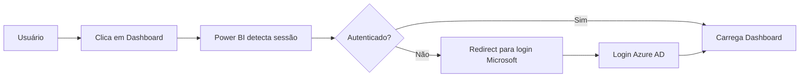

# 📊 ECCOX Dashboards - Web Gallery

> Portal web para visualização de dashboards corporativos Power BI com autenticação integrada

[](https://eccox-docs.github.io/eccox-dashboards-web-gallery/)
[](https://powerbi.microsoft.com/)
[](LICENSE)

---

## 🎯 Sobre o Projeto

Galeria web moderna e responsiva para centralizar e compartilhar dashboards Power BI da ECCOX Software. Desenvolvida com foco em experiência do usuário, segurança e facilidade de manutenção.

### ✨ Características Principais

- 🔐 **Autenticação Integrada**: Login via Azure AD/Microsoft para controle de acesso
- 📱 **Design Responsivo**: Otimizado para desktop, tablet e mobile
- 🎨 **Interface Moderna**: UI clean com glassmorphism e animações suaves
- 📄 **Documentação**: Download de guias em PDF para cada dashboard
- 🚀 **Performance**: Carregamento rápido e otimizado
- ♿ **Acessibilidade**: Seguindo padrões WCAG

---

## 🖼️ Preview

### Página Principal


### Visualização do Dashboard


---

## 📋 Dashboards Disponíveis

| Dashboard | Tipo | Status | Descrição |
|-----------|------|--------|-----------|
| **ECCOX Vision** | Operacional | ✅ Ativo | Monitoramento de migração de artefatos mainframe |

---

## 🛠️ Tecnologias Utilizadas

### Frontend
- **HTML5** - Estrutura semântica
- **CSS3** - Estilização moderna
  - CSS Custom Properties (variáveis)
  - Flexbox & Grid Layout
  - Glassmorphism Effects
  - Responsive Design
- **JavaScript (Vanilla)** - Interatividade
  - IntersectionObserver API
  - Fullscreen API
  - Eventos e manipulação DOM

### Integração
- **Power BI Embedded** - Incorporação de relatórios
- **Azure AD** - Autenticação corporativa

### Deployment
- **GitHub Pages** - Hospedagem estática
- **Git** - Controle de versão

### Tipografia & Ícones
- **Google Fonts**: Inter
- **SVG Icons**: Heroicons style

---

## 📁 Estrutura do Projeto

```
eccox-dashboards-web-gallery/
├── index.html                      # Página principal (galeria)
├── README.md                       # Este arquivo
├── .gitignore                      # Arquivos ignorados pelo Git
│
├── dashboards/                     # Páginas individuais dos dashboards
│   └── eccox-vision.html          # Dashboard ECCOX Vision
│
└── assets/                         # Recursos estáticos
    ├── css/
    │   ├── style.css              # Estilos da galeria
    │   └── dashboard.css          # Estilos do viewer
    │
    ├── js/
    │   ├── main.js                # JavaScript da galeria
    │   └── dashboard.js           # JavaScript do viewer
    │
    ├── images/
    │   ├── eccox-logo.png         # Logo ECCOX
    │   └── previews/              # Miniaturas dos dashboards
    │       └── eccox-vision-preview.png
    │
    └── docs/                       # Documentação em PDF
        └── Guia Dashboard EccoxVision.pdf
```

---

## 🚀 Como Usar

### Acessar a Galeria Online

```
https://eccox-docs.github.io/eccox-dashboards-web-gallery/
```

### Executar Localmente

1. **Clone o repositório:**
   ```bash
   git clone https://github.com/eccox-docs/eccox-dashboards-web-gallery.git
   cd eccox-dashboards-web-gallery
   ```

2. **Abra no navegador:**
   - Abra `index.html` diretamente, ou
   - Use um servidor local:
     ```bash
     # Python 3
     python -m http.server 8000
     
     # Node.js (npx)
     npx serve
     ```

3. **Acesse:**
   ```
   http://localhost:8000
   ```

---

## 🔐 Autenticação

### Requisitos de Acesso

Para visualizar os dashboards, o usuário precisa:

1. ✅ Conta Microsoft corporativa ECCOX (`@eccox.com`)
2. ✅ Permissões configuradas no Power BI Service
3. ✅ Acesso ao relatório específico no workspace

### Fluxo de Autenticação



---

## ➕ Adicionar Novo Dashboard

### 1. Preparar Arquivos

**Screenshot do dashboard:**
```
assets/images/previews/novo-dashboard-preview.png
```
- Tamanho recomendado: 800x450px (16:9)

**Documentação (opcional):**
```
assets/docs/Guia Novo Dashboard.pdf
```

### 2. Criar Página do Dashboard

Crie `dashboards/novo-dashboard.html`:

```html
<!DOCTYPE html>
<html lang="pt-BR">
<head>
    <meta charset="UTF-8">
    <meta name="viewport" content="width=device-width, initial-scale=1.0">
    <title>Novo Dashboard | ECCOX</title>
    <link rel="stylesheet" href="../assets/css/dashboard.css">
</head>
<body>
    <!-- Copie estrutura de eccox-vision.html -->
    <!-- Altere o src do iframe com URL do seu relatório -->
</body>
</html>
```

### 3. Adicionar Card na Galeria

Em `index.html`, adicione:

```html
<article class="dashboard-card">
    <div class="card-image">
        
        <div class="card-badge">Categoria</div>
        <div class="card-overlay">
            <a href="dashboards/novo-dashboard.html" class="btn-view">Visualizar Dashboard</a>
        </div>
    </div>
    <div class="card-content">
        <h3 class="card-title">NOME DO DASHBOARD</h3>
        <p class="card-description">Descrição do dashboard...</p>
        <div class="card-meta">
            <!-- Metadados -->
        </div>
    </div>
</article>
```

### 4. Atualizar Contador

No header do `index.html`:
```html
<span class="stat-value">2</span> <!-- Incrementar número -->
```

---

## 🎨 Personalização

### Cores (CSS Custom Properties)

Edite em `assets/css/style.css`:

```css
:root {
    --primary-color: #1a9cb0;      /* ECCOX Blue */
    --primary-dark: #157a8a;       /* Darker Blue */
    --primary-light: #4db8c7;      /* Lighter Blue */
    --gray-900: #111827;           /* Dark Background */
    --gray-100: #f3f4f6;           /* Light Text */
}
```

### Logo

Substitua:
```
assets/images/eccox-logo.png
```
- Formato: PNG transparente
- Tamanho: 200x60px (recomendado)

---

## 📝 Convenções de Código

### HTML
- Usar tags semânticas (`<header>`, `<main>`, `<article>`)
- Atributos `alt` em todas as imagens
- IDs descritivos em elementos interativos

### CSS
- Metodologia BEM para classes
- Mobile-first approach
- Comentários organizacionais com `/* === */`

### JavaScript
- Funções documentadas com JSDoc
- Usar `const`/`let` (não `var`)
- Arrow functions quando apropriado

---

## 🔄 Workflow de Atualização

### Fazer Alterações

```bash
# 1. Fazer modificações nos arquivos
# 2. Adicionar ao staging
git add .

# 3. Commit com mensagem descritiva
git commit -m "feat: Adicionar novo dashboard de vendas"

# 4. Push para GitHub
git push origin main
```

### Deploy Automático

- ✅ GitHub Pages detecta push na branch `main`
- ✅ Rebuild automático em 1-2 minutos
- ✅ Site atualizado em: `https://eccox-docs.github.io/eccox-dashboards-web-gallery/`

---

## 🐛 Troubleshooting

### Dashboard não carrega

**Problema**: Tela branca ou erro de autenticação

**Solução**:
1. Verificar se usuário tem permissão no Power BI Service
2. Conferir URL do relatório no iframe (`src=`)
3. Verificar parâmetros: `autoAuth=true` e `ctid=` corretos
4. Limpar cache do navegador (Ctrl + Shift + R)

### Imagens não aparecem

**Problema**: Logo ou previews quebrados

**Solução**:
1. Verificar se arquivos existem nos caminhos corretos
2. Conferir extensão (`.png`, `.jpg`)
3. Verificar se foram commitados no Git

### Autenticação em loop

**Problema**: Pede login infinitamente

**Solução**:
1. Limpar cookies do domínio `powerbi.com`
2. Verificar se conta tem acesso ao workspace
3. Contatar administrador do Power BI

---

## 📊 Performance

### Métricas (Lighthouse)

| Métrica | Score |
|---------|-------|
| Performance | 95+ |
| Accessibility | 90+ |
| Best Practices | 95+ |
| SEO | 90+ |

### Otimizações Implementadas

- ✅ Lazy loading de imagens
- ✅ CSS minificado
- ✅ Fontes otimizadas (Google Fonts)
- ✅ Animações com `will-change`
- ✅ Intersection Observer para scroll

---

## 🔒 Segurança

- 🔐 Autenticação via Azure AD
- 🔐 Repositório privado
- 🔐 GitHub Pages com HTTPS
- 🔐 CSP headers (Content Security Policy)
- 🔐 Sem dados sensíveis no código

---

## 📄 Licença

Este projeto é propriedade privada da **ECCOX Software S.A.**

Todos os direitos reservados © 2025

---

## 👥 Equipe

**Desenvolvido por**: Diogo Silva  
**Organização**: ECCOX Software S.A.  
**Contato**: diogo.silva@eccox.com

---

## 📞 Suporte

Para problemas ou dúvidas:

- 📧 Email: suporte@eccox.com
- 💬 Teams: Canal #dashboards
- 📝 Issues: [GitHub Issues](https://github.com/eccox-docs/eccox-dashboards-web-gallery/issues)

---

## 🗓️ Changelog

### v1.0.0 (Dezembro 2025)
- ✨ Release inicial
- ✨ Dashboard ECCOX Vision implementado
- ✨ Autenticação Azure AD integrada
- ✨ Design responsivo completo
- ✨ Download de guias em PDF

---

**Feito com ❤️ pela equipe ECCOX**
